# Experiment Report

## Abstract

This report presents an EEG motor imagery classification project built around standardized preprocessing, reproducible experiment entry points, and clearly separated evaluation protocols. Using the BNCI 2014-001 left-versus-right motor imagery task, the project evaluates classical baselines, a Riemannian tangent-space baseline, and EEGNet under within-subject, LOSO, and cross-subject transfer settings. The main result is that model ranking is protocol-dependent: `FBCSP` is strongest in within-subject evaluation, `EEGNet` is strongest in LOSO and transfer, and `Riemann` remains the strongest non-deep transfer baseline. Repeated-seed transfer validation indicates that the transfer advantage of `EEGNet` is not explained by a single favorable calibration split.

Keywords: EEG motor imagery classification, BNCI2014_001, CSP, FBCSP, Riemannian geometry, EEGNet, LOSO, transfer learning

## 1. Introduction

The project focuses on left-versus-right motor imagery classification using the BNCI 2014-001 dataset. Its central aim is to compare classical, geometric, and deep approaches under a single coherent experimental design rather than mixing claims across incompatible settings.

The codebase explicitly separates within-subject evaluation, cross-subject LOSO evaluation, and calibration-aware transfer evaluation so that each result can be interpreted in its intended regime.

## 2. Data and Method

### 2.1 Dataset

- source dataset: `BNCI2014_001`
- subjects: `1-9`
- task definition: binary classification of `left_hand` versus `right_hand`

### 2.2 Canonical preprocessing

The project uses one canonical preprocessing path for baseline experiments:

- `50 Hz` notch filtering
- `8-32 Hz` band-pass filtering
- epoch window `0.0-4.0 s`
- left/right event extraction only

Optional operations such as average reference and ICA are exposed through configuration rather than being changed implicitly across analyses.

### 2.3 Model families

- classical baselines: raw power + LDA, CSP + LDA, FBCSP + LDA
- riemannian baseline: covariance estimation + tangent-space mapping + LDA
- deep baseline: EEGNet

For FBCSP, feature selection is now performed inside the training pipeline so that train-fold and evaluation-fold logic remain separated.

## 3. Experimental Setup

The project now distinguishes three protocol families:

### 3.1 Within-subject CV

Used for subject-specific baselines. Each subject is evaluated with stratified cross-validation under a fixed split rule.

### 3.2 Leave-one-subject-out

Used for subject-independent evaluation. One subject is held out for testing while the remaining subjects are used for training.

### 3.3 Cross-subject transfer

Used for adaptation analysis. A target subject is split into calibration and evaluation subsets. Results are reported separately for:

- `zero_shot`
- `few_shot` adaptation levels such as `5_shot`, `10_shot`, `20_shot`, and `30_shot`

This separation prevents within-subject and adaptation scores from being conflated with strict subject-independent performance.

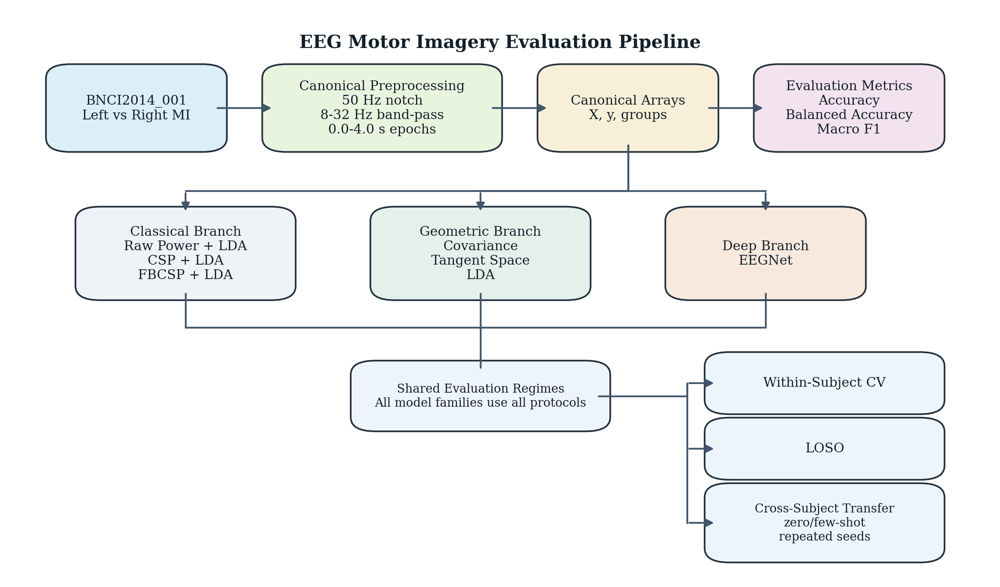

*Figure 1. End-to-end evaluation pipeline used in the project. A single canonical preprocessing path feeds three model families, and each family is evaluated under explicitly separated within-subject, LOSO, and cross-subject transfer protocols.*

## 4. Results

The project produces report-ready summaries for:

- per-subject LOSO rows
- zero-shot and few-shot transfer rows
- aggregated mean and standard deviation across folds or subjects
- exported tables and figures under `docs/assets/generated/`

### 4.1 Verification snapshot

A subject-level sanity check was first performed on `subject 1` with the project pipeline.

| Model | Protocol | Setting | Accuracy | Balanced Accuracy | Macro F1 |
|---|---|---|---:|---:|---:|
| Raw Power + LDA | within-subject CV | default | `0.5000` | `0.5000` | `0.3333` |
| CSP + LDA | within-subject CV | default | `0.8368` | `0.8371` | `0.8353` |
| FBCSP + LDA | within-subject CV | default | `0.9132` | `0.9137` | `0.9129` |
| Riemann + Tangent Space + LDA | within-subject CV | default | `0.8368` | `0.8374` | `0.8360` |
| EEGNet | within-subject CV | `5` epochs verification run | `0.5381` | `0.5365` | `0.5039` |

These numbers serve as a compact verification check that the implementation runs end-to-end and exports reusable artifacts.

### 4.1.1 Subject-level EDA snapshot

As a first post-result analysis step, subject-level exploratory figures were generated from the canonical preprocessing path for `subject 1`. These figures are not meant to prove model performance directly, but to verify that the project pipeline preserves recognizable class structure and physiologically plausible signal patterns.

For time-frequency inspection, the report uses the standard baseline-relative power-change definition:

$$
\Delta P(t, f) = 100 \times \frac{P(t, f) - P_{\mathrm{base}}(f)}{P_{\mathrm{base}}(f)}
$$

Here, $P_{\mathrm{base}}(f)$ is the average power during the pre-cue interval $[-0.5, 0.0]\,\mathrm{s}$. Under this convention:

- positive values mean power increased relative to baseline
- negative values mean power decreased relative to baseline
- values near zero mean little change from baseline

This distinction matters for interpretation. The full ERDS map below is useful as a broad time-frequency response overview, but it is not the clearest figure for explaining left-versus-right motor imagery to non-specialists. For that purpose, the later sensorimotor summary focusing on `C3`, `C4`, and the `mu`/`beta` bands is the more appropriate explanatory figure.

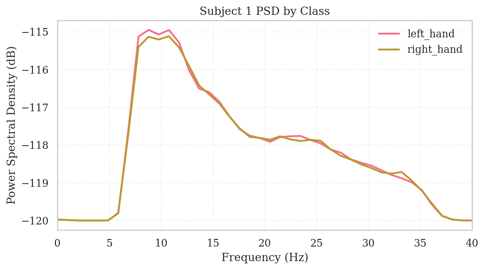

*Figure 2. Subject 1 class-wise power spectral density under the canonical preprocessing pipeline. The plot serves as a spectral sanity check, confirming that the data path preserves stable broad-band structure for left- and right-hand imagery trials.*

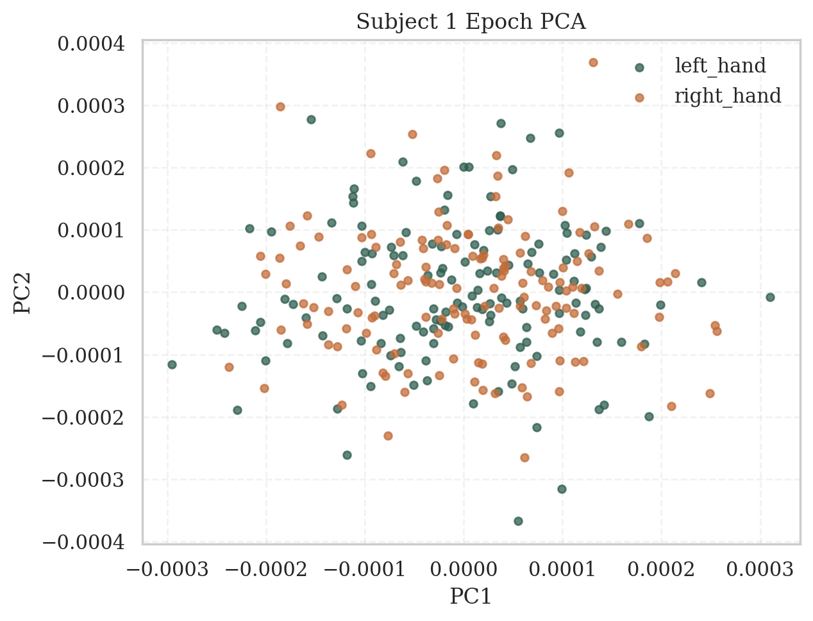

*Figure 3. Subject 1 epoch-level PCA projection from the canonical epoched arrays. Although the classes are not linearly separable in this raw projection, the plot confirms that the array extraction retains class-conditional structure worth modeling.*

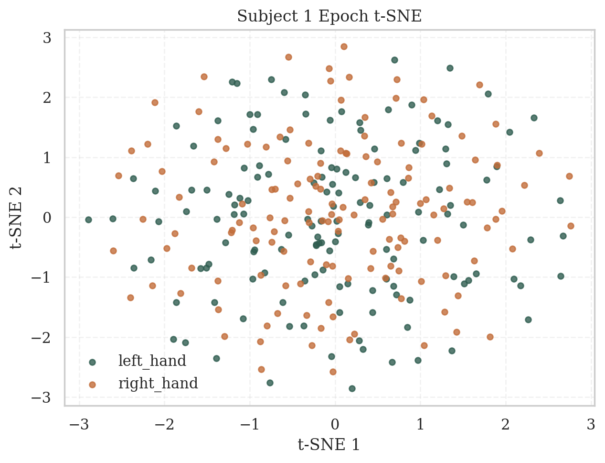

*Figure 4. Subject 1 epoch-level t-SNE projection from the canonical epoched arrays. This non-linear view makes local clustering tendencies more visible than PCA and provides a complementary view of class structure in the epoched arrays.*

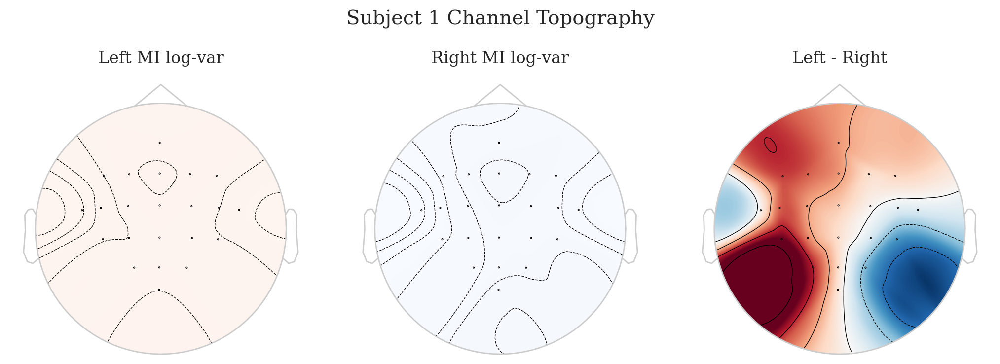

*Figure 5. Subject 1 topographic log-variance maps for left-hand imagery, right-hand imagery, and their difference. These maps verify that the preprocessing pipeline yields plausible channel-level spatial structure before moving to CSP, Riemannian, or deep models.*

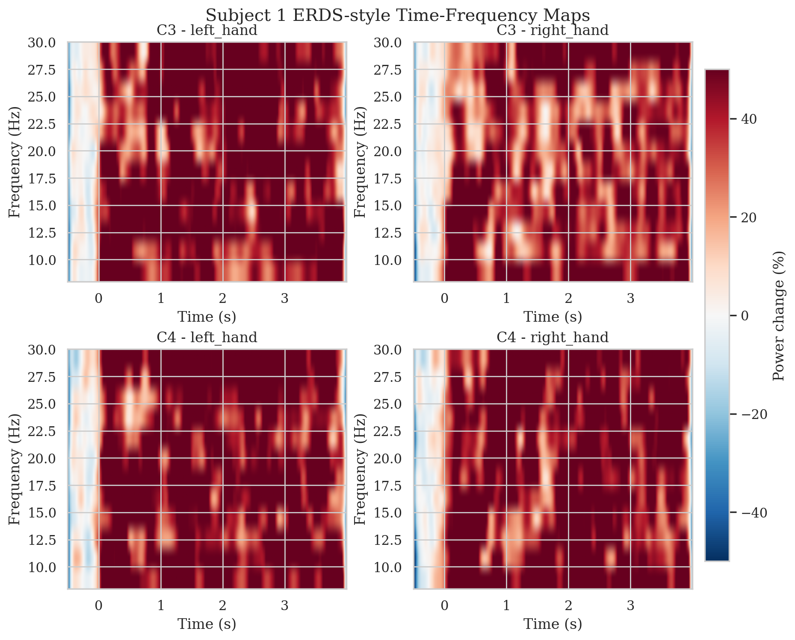

*Figure 6. Subject 1 ERDS-style time-frequency maps for representative central electrodes. The figure is computed from EDA epochs with a `-0.5 s` pre-cue window and uses that interval as the reference baseline.*

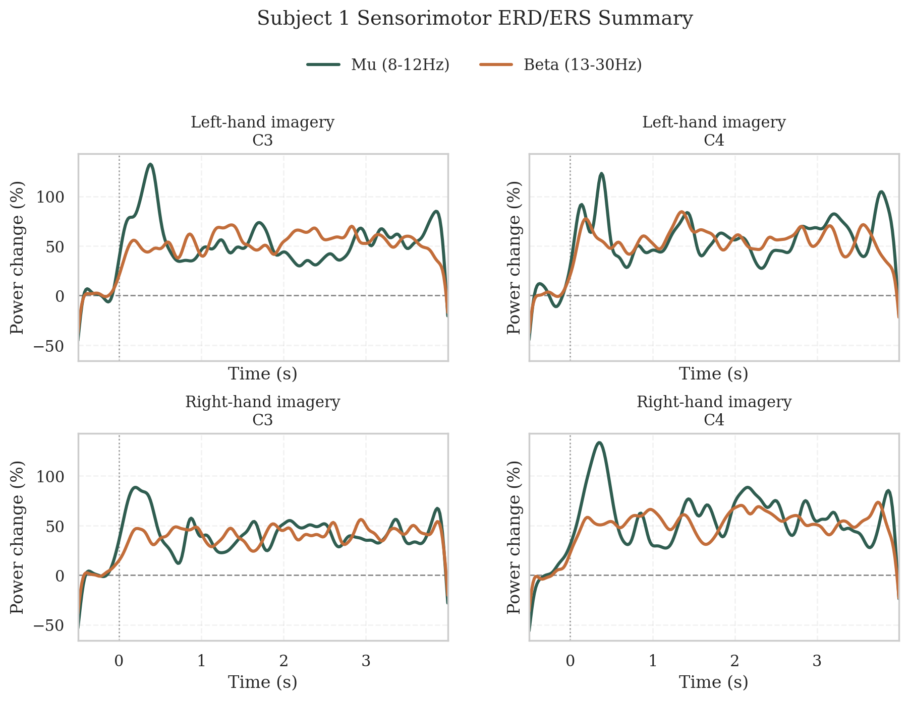

*Figure 7. Subject 1 sensorimotor ERD/ERS summary at `C3` and `C4`, separated by left- and right-hand imagery and summarized over the `mu` and `beta` bands. This is the most direct explanatory view for communicating how task-related synchronization and desynchronization evolve over time at the key motor electrodes.*

In short, Figure 6 answers the broad question “does the EEG spectrum react to the task over time?”, whereas Figure 7 is better suited to the more specific question “how do left- and right-hand motor imagery alter sensorimotor rhythms at the key motor electrodes?”.

The same EDA export was also repeated for representative subjects with different downstream difficulty profiles. `S2`, which is one of the harder subjects in the classification tables, and `S8`, which is one of the easier ones, both preserve the same broad analysis structure while differing in how clearly the left/right sensorimotor trends appear.

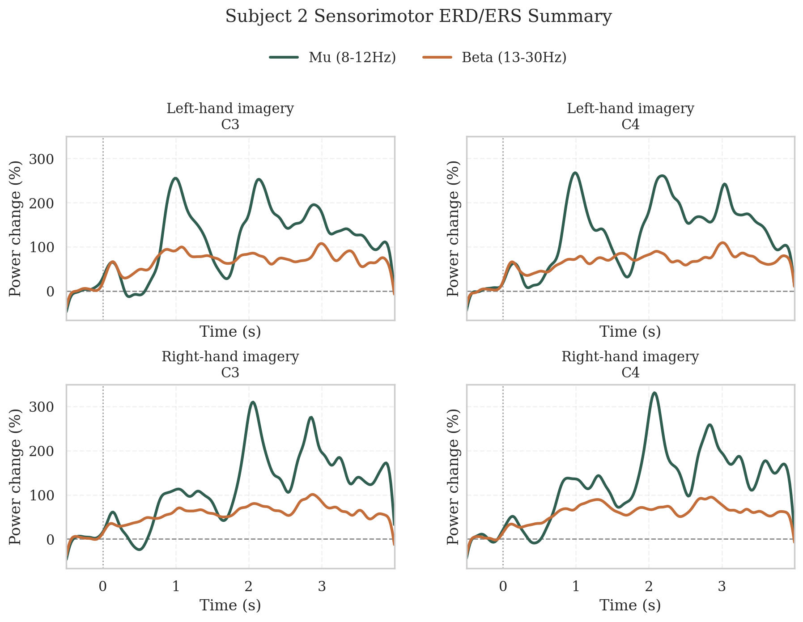

*Figure 8. Subject 2 sensorimotor ERD/ERS summary. `S2` is one of the harder subjects in the downstream classification tables, so this figure illustrates that the pipeline can still recover task-related sensorimotor structure even when the left/right contrast is weaker and less separable.*

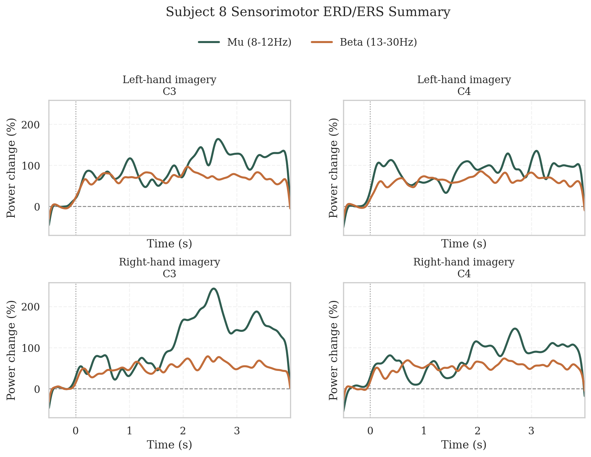

*Figure 9. Subject 8 sensorimotor ERD/ERS summary. `S8` is one of the easier subjects in the downstream tables, and the clearer left/right contrast provides a useful visual counterpoint to `S2`.*

This is important for interpretation: the EDA is not meant to claim that every participant expresses equally clean lateralized motor-imagery dynamics. Instead, it shows that the pipeline can recover the intended physiological views while still leaving room for subject-to-subject variability, which is consistent with the strong difficulty differences seen in the quantitative evaluation tables.

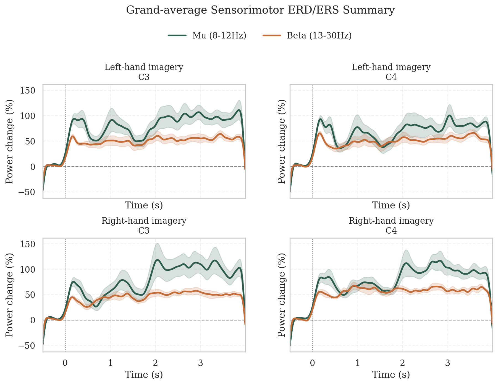

*Figure 10. Grand-average sensorimotor ERD/ERS summary across all `9` subjects. This figure reduces dependence on one selected participant while preserving the motor-electrode and band-limited interpretation. It should be read as a population-level average, not as a replacement for the subject-specific examples above.*

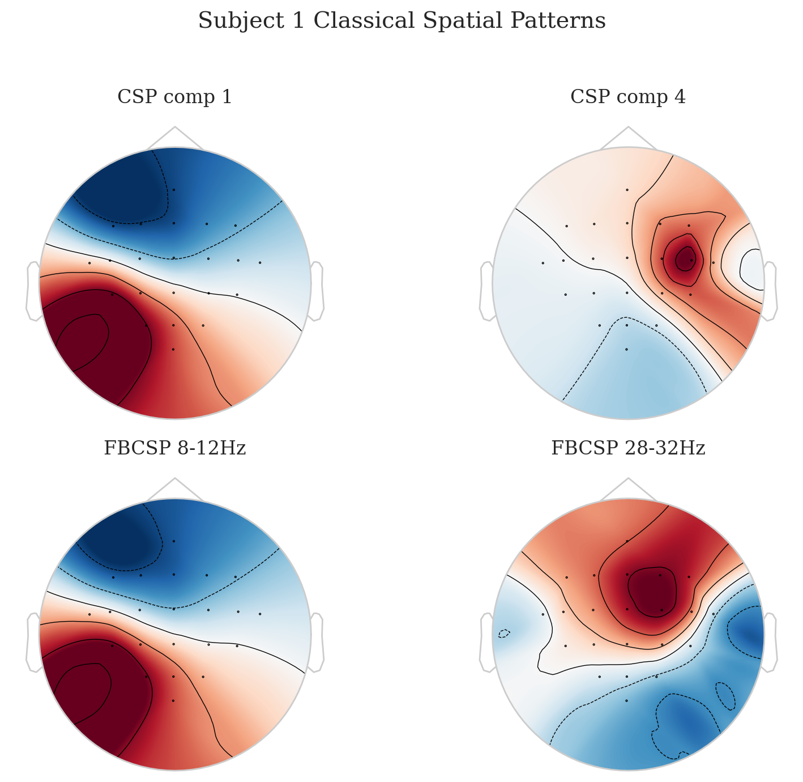

*Figure 11. Subject 1 classical spatial pattern topomaps learned from the `CSP` and `FBCSP` pipelines. The figure shows how discriminative spatial filters emphasize different scalp regions and frequency bands.*

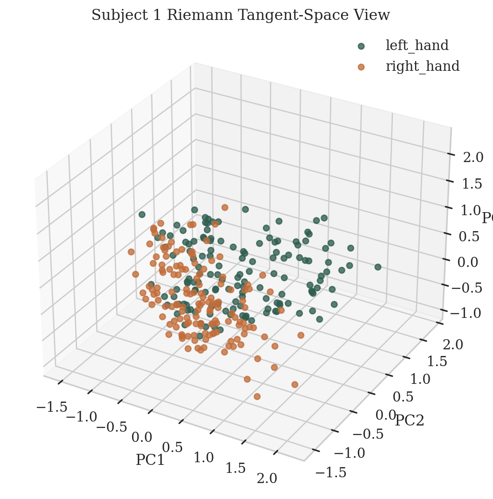

*Figure 12. Subject 1 Riemann tangent-space view after a 3D PCA projection. This is a qualitative geometry-aware EDA view included for visual intuition only, not as a standalone quantitative argument.*

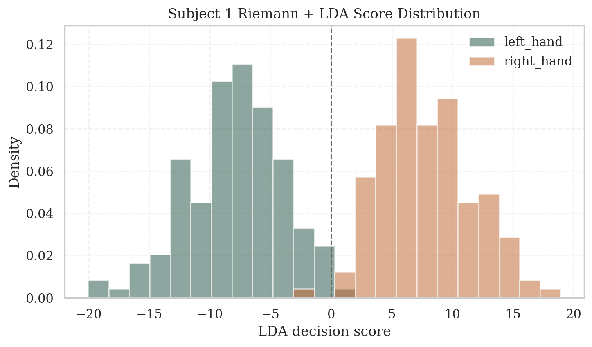

*Figure 13. Subject 1 Riemann + LDA score distribution. As with the CSP-based decision plot, this figure is included as a qualitative subject-level separability view rather than a standalone model-comparison result.*

For covariance-based methods, the geometric motivation can be summarized without overstating the present experiments. If $C_i$ denotes the covariance of trial $i$, the Euclidean mean is

$$
\bar{C}_{E} = \frac{1}{N}\sum_{i=1}^{N} C_i,
$$

whereas the Riemannian mean is defined implicitly as

$$
\bar{C}_{R} = \arg\min_{C \in \mathrm{SPD}} \sum_{i=1}^{N} d_R^2(C, C_i).
$$

This distinction matters because covariance matrices live on the manifold of symmetric positive-definite matrices. In practice, the geometric view is often motivated by the idea that Euclidean averaging can introduce swelling-like distortions, whereas the Riemannian mean respects the geometry of the SPD space. The present project uses this as methodological motivation only; it does not claim to measure swelling effect directly in a separate dedicated experiment.

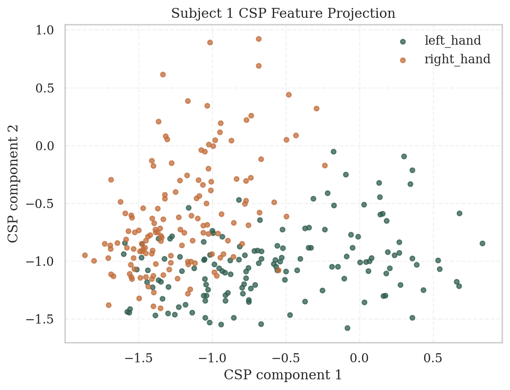

*Figure 14. Subject 1 CSP feature projection using the first two CSP components. This figure is more appropriate than a grand-average embedding because the CSP space is learned at the subject level, so it serves as a local separability check rather than a population-level summary.*

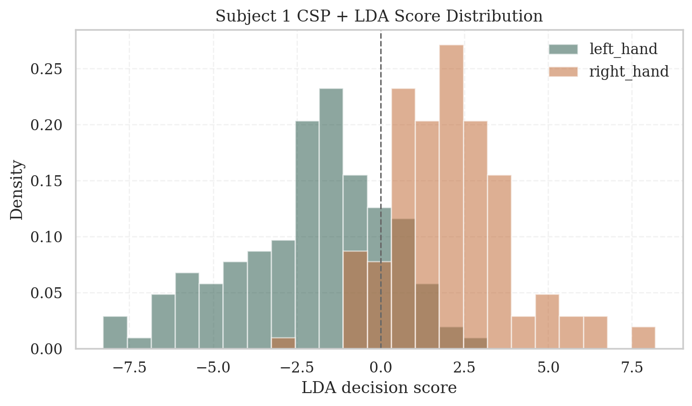

*Figure 15. Subject 1 CSP + LDA score distribution. This supplementary view summarizes how the subject-level CSP representation separates the two imagery classes in the downstream linear decision space, while still showing the remaining overlap between class score distributions.*

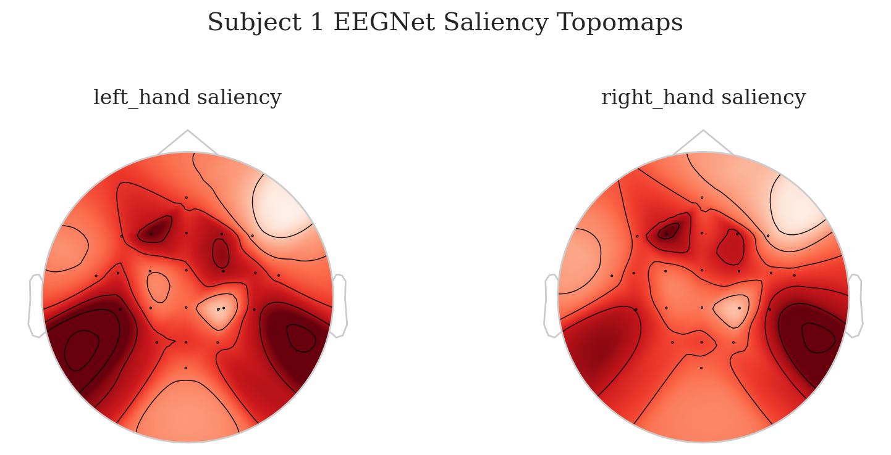

*Figure 16. Subject 1 EEGNet saliency topomaps obtained from input-gradient attribution. The plot is included as a lightweight XAI view showing which scalp regions contribute most strongly to the class-specific output gradients. It should be interpreted cautiously as a first-order attribution summary rather than as a definitive mechanistic explanation.*

### 4.2 Completed full run: Riemann within-subject CV

The first completed all-subject result table is the Riemannian tangent-space baseline under within-subject cross-validation.

| Subject | Accuracy | Balanced Accuracy | Macro F1 |
|---|---:|---:|---:|
| `S1` | `0.8368` | `0.8374` | `0.8360` |
| `S2` | `0.6008` | `0.6011` | `0.6001` |
| `S3` | `0.9826` | `0.9828` | `0.9826` |
| `S4` | `0.7779` | `0.7775` | `0.7771` |
| `S5` | `0.6425` | `0.6425` | `0.6395` |
| `S6` | `0.7570` | `0.7568` | `0.7561` |
| `S7` | `0.8055` | `0.8054` | `0.8039` |
| `S8` | `0.9480` | `0.9479` | `0.9479` |
| `S9` | `0.8092` | `0.8089` | `0.8084` |
| `Mean` | `0.7956` | `0.7956` | `0.7946` |

Aggregate summary:

- accuracy: `0.7956 +- 0.1171`
- balanced accuracy: `0.7956 +- 0.1171`
- macro F1: `0.7946 +- 0.1176`

This `9`-subject table shows that subject difficulty varies substantially, which is exactly why per-subject reporting and protocol separation matter in this project.

### 4.3 Completed full run: Classical within-subject CV

The classical `9`-subject baseline results are summarized below.

| Model | Accuracy Mean ± Std | Balanced Accuracy Mean ± Std | Macro F1 Mean ± Std |
|---|---:|---:|---:|
| Raw Power + LDA | `0.5355 +- 0.0625` | `0.5364 +- 0.0620` | `0.4210 +- 0.1162` |
| CSP + LDA | `0.7810 +- 0.1290` | `0.7810 +- 0.1287` | `0.7793 +- 0.1303` |
| FBCSP + LDA | `0.8183 +- 0.1304` | `0.8184 +- 0.1304` | `0.8175 +- 0.1310` |

Key observations:

- `raw power` remains only slightly above chance and is not competitive as a practical baseline
- `CSP` provides a large jump over raw power and remains a strong classical reference
- `FBCSP` is currently the strongest verified classical model, outperforming both `CSP` and the Riemannian baseline on mean accuracy in the completed within-subject runs

Selected subject-level patterns reinforce the need for per-subject reporting:

- `FBCSP` is extremely strong on `S1`, `S5`, and `S8`
- `CSP` and `Riemann` are closer on several subjects, but `Riemann` is more stable than raw power and less dominant than `FBCSP`
- difficult subjects such as `S2` still limit all classical methods

### 4.4 Completed full run: EEGNet within-subject CV

The all-subject deep-learning baseline has now been rerun with `EEGNet` under a `50`-epoch cap and validation-based early stopping.

| Subject | Accuracy | Balanced Accuracy | Macro F1 |
|---|---:|---:|---:|
| `S1` | `0.7061` | `0.7062` | `0.7051` |
| `S2` | `0.4861` | `0.4862` | `0.4781` |
| `S3` | `0.9130` | `0.9132` | `0.9128` |
| `S4` | `0.6877` | `0.6863` | `0.6819` |
| `S5` | `0.5067` | `0.5067` | `0.4300` |
| `S6` | `0.5174` | `0.5190` | `0.4443` |
| `S7` | `0.5034` | `0.5052` | `0.4072` |
| `S8` | `0.9618` | `0.9618` | `0.9617` |
| `S9` | `0.8891` | `0.8888` | `0.8883` |
| `Mean` | `0.6857` | `0.6859` | `0.6566` |

Aggregate summary:

- accuracy: `0.6857 +- 0.1835`
- balanced accuracy: `0.6859 +- 0.1832`
- macro F1: `0.6566 +- 0.2124`

For the finalized deep baseline, EEGNet is trained under a `50`-epoch cap with a validation split and best-epoch restoration under early stopping. Under this training rule, EEGNet still does not surpass the strongest classical baselines in within-subject accuracy. Across `45` fold-level training histories, the mean best epoch is about `32.6`, the mean executed epoch count is about `37.2`, and early stopping triggered in `18` folds.

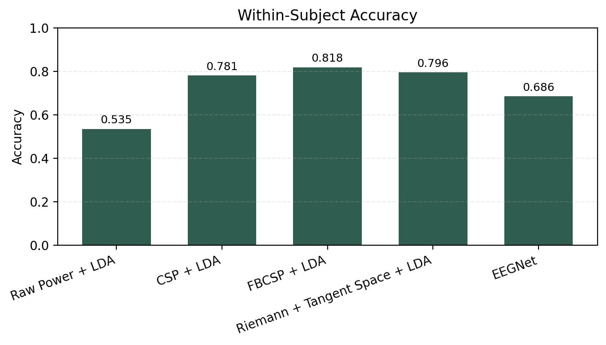

*Figure 17. Within-subject accuracy comparison across the verified baselines. The figure highlights the subject-specific advantage of `FBCSP`, with `Riemann` and `CSP` remaining competitive and `EEGNet` trailing the strongest classical pipelines under this protocol.*

### 4.5 Interpretation

- the raw-power baseline stays near chance level, as expected for a weak feature representation
- `FBCSP` is the strongest verified within-subject model, while `CSP` and `Riemann` remain competitive subject-specific baselines
- subject difficulty is highly uneven, with lower-performing cases such as `S2` and `S5` pulling down the overall mean and motivating protocol-level rather than single-subject conclusions

### 4.6 Completed LOSO run: Riemann subject-independent evaluation

The LOSO tables below include the Riemannian tangent-space baseline, the classical baselines, and the updated `EEGNet` run with validation-based early stopping.

| Model | Accuracy Mean ± Std | Balanced Accuracy Mean ± Std | Macro F1 Mean ± Std |
|---|---:|---:|---:|
| Raw Power + LDA | `0.5270 +- 0.0517` | `0.5270 +- 0.0517` | `0.4045 +- 0.1043` |
| CSP + LDA | `0.5907 +- 0.1082` | `0.5907 +- 0.1082` | `0.5258 +- 0.1516` |
| FBCSP + LDA | `0.5648 +- 0.0639` | `0.5648 +- 0.0639` | `0.5104 +- 0.1143` |
| Riemann + Tangent Space + LDA | `0.6258 +- 0.0989` | `0.6258 +- 0.0989` | `0.5895 +- 0.1307` |
| EEGNet | `0.6971 +- 0.1358` | `0.6971 +- 0.1358` | `0.6829 +- 0.1481` |

At the subject-independent level, the ranking changes relative to within-subject CV. `EEGNet` becomes the strongest verified baseline, `Riemann` remains the strongest non-deep baseline, and `CSP` slightly exceeds `FBCSP`.

| Subject | Accuracy | Balanced Accuracy | Macro F1 |
|---|---:|---:|---:|
| `S1` | `0.7847` | `0.7847` | `0.7837` |
| `S2` | `0.5799` | `0.5799` | `0.5601` |
| `S3` | `0.8819` | `0.8819` | `0.8803` |
| `S4` | `0.7326` | `0.7326` | `0.7315` |
| `S5` | `0.6285` | `0.6285` | `0.6217` |
| `S6` | `0.6424` | `0.6424` | `0.6256` |
| `S7` | `0.6875` | `0.6875` | `0.6686` |
| `S8` | `0.7431` | `0.7431` | `0.7353` |
| `S9` | `0.5938` | `0.5938` | `0.5395` |
| `Mean` | `0.6971` | `0.6971` | `0.6829` |

Aggregate summary:

- accuracy: `0.6971 +- 0.1358`
- balanced accuracy: `0.6971 +- 0.1358`
- macro F1: `0.6829 +- 0.1481`

Compared with its within-subject run, `EEGNet` remains more competitive under LOSO than under subject-specific CV. Validation-based early stopping triggered only once across the `9` LOSO fits, with a mean best epoch of about `47.8`, suggesting that most LOSO runs still benefited from training close to the full `50`-epoch budget.

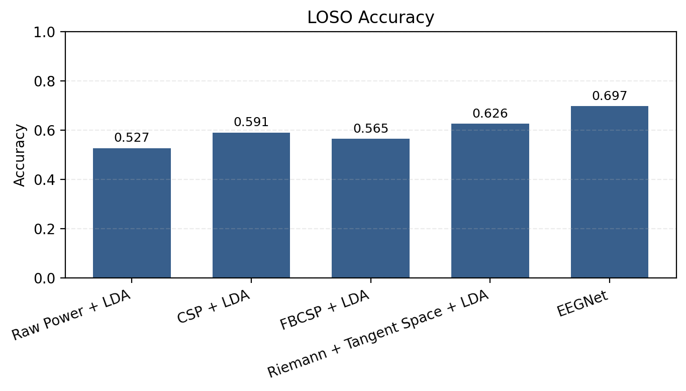

*Figure 18. LOSO accuracy comparison across the verified baselines. Under strict subject-independent evaluation, `EEGNet` becomes the strongest model, while `Riemann` remains the strongest non-deep alternative.*

### 4.7 Completed transfer run: All-target adaptation

The transfer protocol is now verified across all available target subjects. Each model is trained on source subjects, evaluated in `zero_shot` mode, and then adapted with increasing calibration budgets from held-out target subjects.

| Setting | FBCSP | Riemann | EEGNet |
|---|---:|---:|---:|
| `zero_shot` | `0.5640` | `0.6366` | `0.6960` |
| `5_shot` | `0.5687` | `0.6744` | `0.7145` |
| `10_shot` | `0.5772` | `0.6829` | `0.7492` |
| `20_shot` | `0.5818` | `0.7006` | `0.7701` |
| `30_shot` | `0.5903` | `0.7191` | `0.7670` |

Aggregate summaries:

| Model | Accuracy Mean ± Std | Balanced Accuracy Mean ± Std | Macro F1 Mean ± Std |
|---|---:|---:|---:|
| FBCSP Transfer | `0.5764 +- 0.0099` | `0.5764 +- 0.0099` | `0.5211 +- 0.0112` |
| Riemann Transfer | `0.6827 +- 0.0280` | `0.6827 +- 0.0280` | `0.6675 +- 0.0399` |
| EEGNet Transfer | `0.7394 +- 0.0293` | `0.7394 +- 0.0293` | `0.7269 +- 0.0371` |

Several patterns are worth noting:

- `EEGNet` is the strongest verified transfer model across all targets
- `Riemann` is consistently stronger than `FBCSP` in transfer and improves smoothly as calibration shots increase
- the all-target average gives a more stable and credible transfer picture than a single-target subject snapshot

Taken together with the within-subject and LOSO tables, the verified picture is now substantially clearer:

- within-subject: `FBCSP` is strongest
- LOSO: `EEGNet` is strongest
- transfer across all targets: `EEGNet` is strongest, `Riemann` is the strongest non-deep baseline

The previously verified `S2` result is still useful as an example of target-specific variability, but it should no longer be treated as the primary transfer conclusion. The all-target sweep is the more defensible basis for the report narrative.

### 4.8 Repeated-seed transfer validation

To check whether the transfer ranking depends too heavily on one calibration split, repeated-seed all-target transfer sweeps were run for `seed=42,43`.

| Model | Accuracy Mean | 95% CI |
|---|---:|---:|
| FBCSP Transfer | `0.5762` | `[0.5688, 0.5835]` |
| Riemann Transfer | `0.6756` | `[0.6511, 0.7001]` |
| EEGNet Transfer | `0.7411` | `[0.7150, 0.7672]` |

The repeated-seed ranking matches the single-seed all-target ranking:

- `EEGNet` remains the strongest transfer model
- `Riemann` remains clearly stronger than `FBCSP`
- larger calibration budgets still improve `Riemann` and `EEGNet`, while `FBCSP` improves only modestly

Paired permutation checks on repeated seed-target observations reinforce the same interpretation.

`Riemann` versus `FBCSP` accuracy differences:

- `zero_shot`: `+0.0625`, `p ~= 0.0438`
- `5_shot`: `+0.1007`, `p ~= 0.0028`
- `10_shot`: `+0.0984`, `p ~= 0.0032`
- `20_shot`: `+0.1130`, `p ~= 0.0006`
- `30_shot`: `+0.1227`, `p ~= 0.0008`

`EEGNet` versus `Riemann` accuracy differences:

- `zero_shot`: `+0.0648`, `p ~= 0.0014`
- `5_shot`: `+0.0498`, `p ~= 0.0234`
- `10_shot`: `+0.0841`, `p ~= 0.0005`
- `20_shot`: `+0.0714`, `p ~= 0.0024`
- `30_shot`: `+0.0575`, `p ~= 0.0108`

The updated repeated-seed sweep also keeps `EEGNet` above `FBCSP` at every shot setting.

This repeated-seed check makes the transfer conclusion more defensible. The advantage of `EEGNet` in transfer is not just a one-split artifact, and the geometric baseline remains a strong non-deep alternative with a clear advantage over the classical `FBCSP` transfer pipeline.

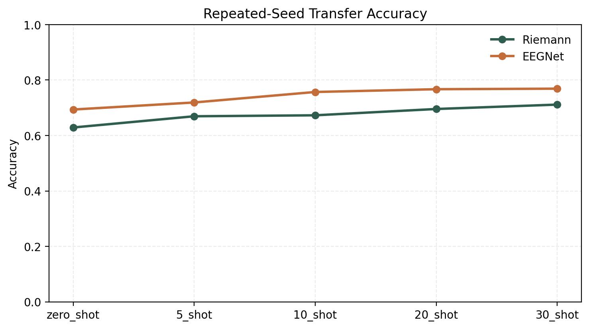

*Figure 19. Repeated-seed transfer accuracy across calibration-shot settings. `EEGNet` remains strongest across all shot budgets, `Riemann` consistently outperforms `FBCSP`, and the qualitative ranking remains stable after repeated calibration splits.*

### 4.9 Error structure and runtime reference

To complement the aggregate accuracy tables, the report also includes representative confusion matrices from the protocol-defining models:

- within-subject: `FBCSP`
- LOSO: `EEGNet`
- repeated-seed transfer: `Riemann`
- repeated-seed transfer: `EEGNet`

These figures are not intended to replace the main quantitative tables. Instead, they help show whether the remaining errors are strongly asymmetric between left- and right-hand imagery or whether the dominant issue is a more balanced overlap between the two classes.

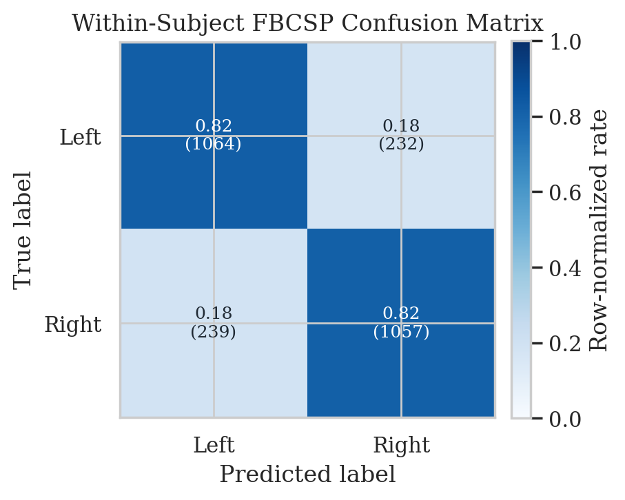

*Figure 20. Row-normalized confusion matrix for the within-subject `FBCSP` baseline. The strong diagonal indicates that the best subject-specific model keeps both left- and right-hand imagery errors comparatively low under the standardized cross-validation setting.*

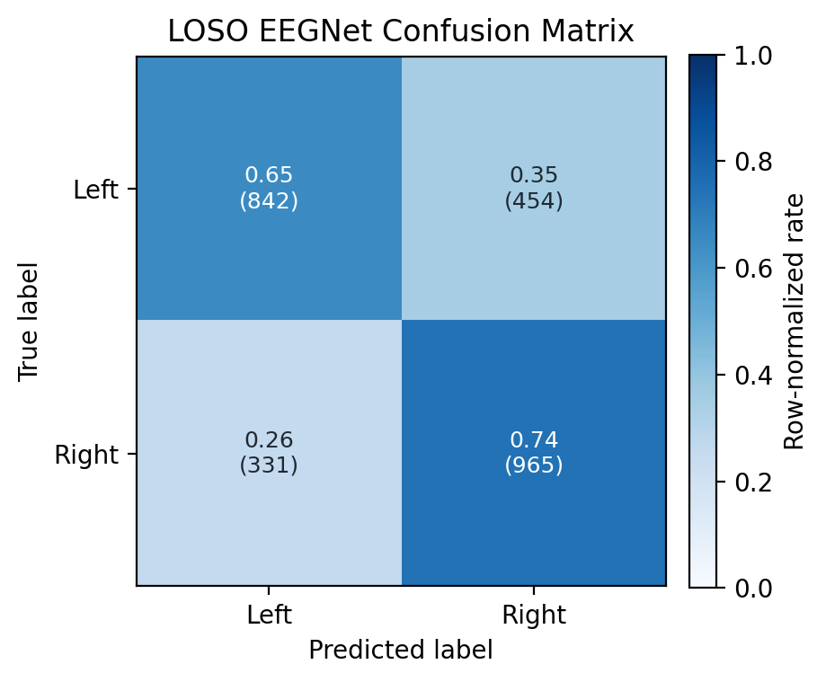

*Figure 21. Row-normalized confusion matrix for LOSO `EEGNet`. The diagonal remains dominant, but the larger off-diagonal mass compared with Figure 20 highlights the additional difficulty of strict subject-independent decoding.*

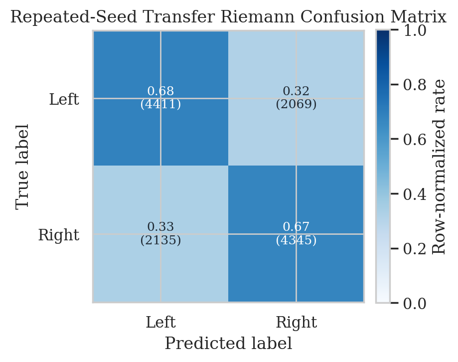

*Figure 22. Row-normalized confusion matrix for repeated-seed all-target transfer with the `Riemann` baseline. The matrix remains meaningfully diagonal, supporting the interpretation that the geometric baseline retains useful transfer structure even when it no longer matches the top deep-learning performance.*

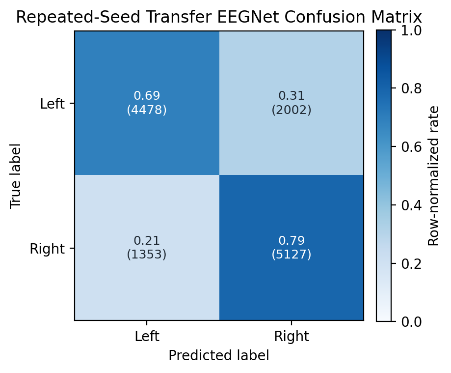

*Figure 23. Row-normalized confusion matrix for repeated-seed all-target transfer with `EEGNet`. The stronger diagonal relative to the geometric baseline is consistent with the accuracy ranking reported in the transfer tables.*

The regenerated representative runs also provide a simple wall-clock reference for model cost. These numbers should be read as implementation-specific measurements from the same local environment, not as hardware-independent benchmark claims.

| Protocol | Representative Model | Runtime (s) | Runtime (min) |
|---|---|---:|---:|
| within-subject | `FBCSP` | `405.20` | `6.75` |
| LOSO | `EEGNet` | `685.16` | `11.42` |
| repeated-seed transfer | `Riemann` | `171.50` | `2.86` |
| repeated-seed transfer | `EEGNet` | `1255.64` | `20.93` |

This comparison adds an important practical nuance to the accuracy discussion:

- `FBCSP` remains the strongest within-subject model, but its cost is already non-trivial even before considering a much heavier repeated-seed transfer setting
- `Riemann` offers the lightest transfer-time representative run among the stronger transfer baselines
- `EEGNet` is the strongest LOSO and transfer model, but it also carries the largest training cost among the representative reruns

Taken together, the report supports not only a protocol-aware performance comparison, but also a first practical performance-cost reading of the same baselines.

## 5. Discussion

The main strength of the project is methodological discipline rather than a claim of a new model family. The central concept, comparing deployable classical pipelines with stronger generalized deep learning approaches, remains valid. What matters is the reliability of the comparison:

- one canonical data definition
- one explicit protocol per claim
- one shared metric family across experiments

The results support a nuanced interpretation. There is no single universal winner across all EEG decoding settings in this project. Instead, the ranking depends on what claim is being made.

- In the within-subject setting, `FBCSP` is the strongest verified model. This suggests that handcrafted band-specific spatial filtering remains highly effective when subject-specific structure is available and evaluation is not forced across subjects.
- In the LOSO setting, `EEGNet` becomes the strongest model. This indicates that once subject-independent generalization becomes the main objective, the deep baseline benefits more than the classical pipelines from pooled cross-subject training.
- In the transfer setting, `EEGNet` again remains strongest, while `Riemann` is the strongest non-deep alternative. The repeated-seed transfer check strengthens this point by showing that `EEGNet > Riemann > FBCSP` is stable across multiple calibration splits rather than a one-split accident.

This means the geometric pipeline should not be treated as the overall best approach in every setting. A better interpretation is that Riemannian modeling remains valuable because it is structurally principled, competitive under subject-independent conditions, and clearly stronger than the classical transfer pipeline, but it is not the top-performing model under the full evaluation. The strongest overall generalization story currently belongs to `EEGNet`, while the strongest subject-specific decoding story still belongs to `FBCSP`.

This interpretation reflects the structure of the evaluation itself: different experimental claims are separated, protocol drift is reduced, and conclusions are tied to the setting in which they are measured.

Further work should add:

- broader repeated-seed transfer runs and calibration resampling
- expanded statistical comparison between classical, geometric, and deep baselines
- figure generation for README and report inclusion
- narrative analysis of difficult subjects and transfer behavior
- filter-bank Riemannian extensions that test whether multi-band tangent-space modeling can recover some of the subject-specific gains seen in `FBCSP` while preserving the stronger transfer behavior of the geometric pipeline
- geometry-aware deep learning variants that test whether Riemannian structure can be combined more directly with the cross-subject generalization and transfer strength already observed for `EEGNet`

## 6. Conclusion

Under a unified preprocessing path and explicitly separated evaluation protocols, the central result is not that one model family dominates everywhere, but that different regimes reward different inductive biases.

The final picture is:

- `FBCSP` is the strongest verified within-subject model
- `EEGNet` is the strongest verified LOSO model
- `EEGNet` is also the strongest verified transfer model under both all-target and repeated-seed evaluation
- `Riemann` remains the strongest non-deep transfer baseline and a meaningful bridge between classical and deep approaches

Accordingly, the most defensible forward-looking claim is not that geometric methods are best in general. A better conclusion is that geometry remains highly informative, but future work should focus on combining geometric structure with deep models that already show stronger cross-subject generalization and adaptation behavior in this evaluation framework.

## Appendix A. EEGNet Optimization Curves

The updated EEGNet results in this report use validation-based early stopping instead of a fixed-epoch recipe. The following curves are included as supplementary material because they document optimization behavior rather than the central protocol comparison.

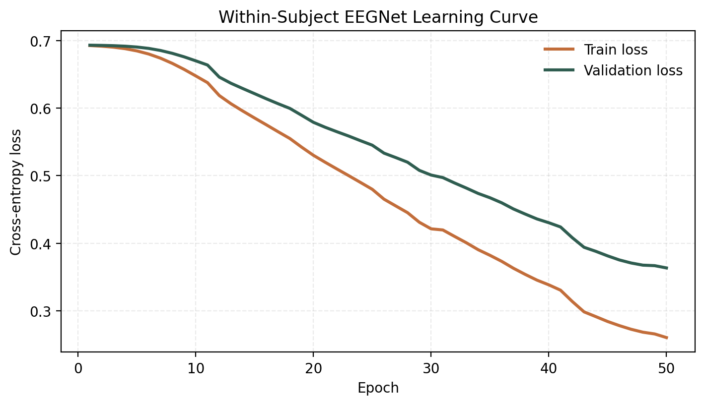

*Figure A1. Mean within-subject EEGNet learning curves across the stored fold histories. The curve extends to the full `50`-epoch axis because it averages all folds that remain active at each epoch; some folds stop earlier, while others continue much closer to the epoch cap. The early-stopping interpretation should therefore be read together with the reported best-epoch and epochs-ran statistics rather than from the tail of the mean curve alone.*

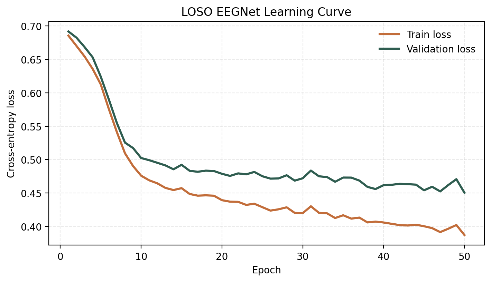

*Figure A2. Mean LOSO EEGNet learning curves across the subject-held-out fits. Relative to within-subject CV, the LOSO runs stay near the full epoch budget more often, which is consistent with the near-maximal best-epoch statistics reported for the updated LOSO rerun.*

## References

1. BNCI Horizon 2020. *001-2014: Left and right hand motor imagery*. https://bnci-horizon-2020.eu/database/data-sets
2. Tangermann M, Muller KR, Aertsen A, et al. *Review of the BCI Competition IV*. Front Neurosci. 2012. https://www.frontiersin.org/journals/neuroscience/articles/10.3389/fnins.2012.00055/full
3. Ramoser H, Muller-Gerking J, Pfurtscheller G. *Optimal spatial filtering of single trial EEG during imagined hand movement*. IEEE Trans Rehabil Eng. 2000. https://pubmed.ncbi.nlm.nih.gov/11204034/
4. Ang KK, Chin ZY, Wang C, Guan C, Zhang H. *Filter Bank Common Spatial Pattern (FBCSP) in brain-computer interface*. Proc IJCNN. 2008. https://pubmed.ncbi.nlm.nih.gov/19963675/
5. Barachant A, Bonnet S, Congedo M, Jutten C. *Multiclass brain-computer interface classification by Riemannian geometry*. IEEE Trans Biomed Eng. 2012. https://pubmed.ncbi.nlm.nih.gov/22010143/
6. Lawhern VJ, Solon AJ, Waytowich NR, Gordon SM, Hung CP, Lance BJ. *EEGNet: a compact convolutional neural network for EEG-based brain-computer interfaces*. J Neural Eng. 2018. https://pubmed.ncbi.nlm.nih.gov/29932424/
7. Jayaram V, Barachant A. *MOABB: trustworthy algorithm benchmarking for BCIs*. J Neural Eng. 2018. https://pubmed.ncbi.nlm.nih.gov/30177583/
8. Gramfort A, Luessi M, Larson E, et al. *MNE software for processing MEG and EEG data*. Neuroimage. 2013. https://pubmed.ncbi.nlm.nih.gov/24161808/
